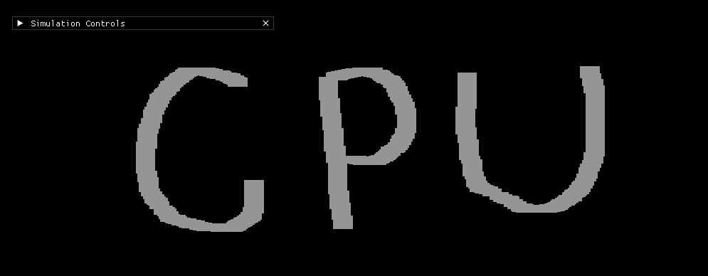

# Falling Sand Simulation



*"From ashes to dust, from CPU to GPU"*

This is the first version of the falling sand simulation. It runs entirely on the **CPU**, using the GPU only to render
a texture quad on the screen. This allows us to run a **1000x1000 simulation** at 60 fps.

I've always been interested in falling sand simulations, but [Noita](https://noitagame.com/) finally inspired me to make
one.

> **Note**: This is the CPU branch. For the GPU-accelerated version using compute shaders, check out
> the [GPU branch](https://github.com/flykiller13/ron-falling-sand/tree/gpu).

## How It Works

### Cell Movement Rules

The rules for cell movement are fairly simple. **Sand** checks `down → down-left → down-right` and if one of these is
empty, it moves there (swaps). **Water** follows the same pattern but additionally checks `left` and `right`, giving it
that characteristic "filling up" effect. **Smoke/Gas** behaves like water but checks upward instead of downward.

```cpp
case CellType::Sand:
    if (can_move_to(x, y - 1)) {
        // Check below
        move_to(x, y, x, y - 1);
    } else {
        if (can_move_to(x + dir, y - 1)) {
            // Check left/right-down
            move_to(x, y, x + dir, y - 1);
        }
    }
    break;
```

### Random Direction Selection

One important mechanic is choosing a **random direction** (left/right) because cells check their neighbors sequentially
and their movement direction needs to be known. This gives the cells a more natural feel - without it, you get a bias
towards one side. Each cell randomly decides whether to check left or right first, creating that organic, chaotic
behavior you'd expect from falling sand.

```cpp
int dir = (dis(gen) == 0) ? -1 : 1; // Randomly choose left or right
```

This is interesting because on the [GPU branch](link-to-gpu-branch), we can't use random since we're using the pull
method - cell movement has to be deterministic.

### Iteration Order

When running the simulation, we iterate over each cell in the grid. The **iteration order matters** for correctness - we
process left to right, and for each column we process from bottom to top (where y=0 is the bottom). This ensures
particles fall naturally and prevents ordering artifacts. We use **double buffering** (reading from `grid`, writing to
`next_grid`) to ensure we always have consistent state during the update, then swap buffers after all cells are
processed. Without proper iteration order, you could get visual artifacts like particles teleporting or not falling
smoothly.

```cpp
// Iterate over grid - order matters!
for (int x = 0; x < grid.width; x++) {
    for (int y = 0; y < grid.height; y++) {
        Cell curr = getCell(x, y);
        // Process cell movement...
    }
}
// Swap buffers after all cells are processed
std::swap(grid.cells, next_grid.cells);
```

### Rendering Pipeline

The cells get translated to colors that are saved in a **pixel array**. Each cell type maps to a specific color (sand →
yellow, water → blue, stone → grey, etc.). The pixel array is then passed to the **texture quad**, which is displayed on
screen.

```cpp
// Convert cells to pixel colors
for (int i = 0; i < cells.size(); i++) {
    Cell cell = cells[i];
    switch (cell.type) {
        case CellType::Sand:
            pixels[i] = color_to_agbr(yellow);
            break;
        // ... other cell types
    }
}
// Update texture with pixel data
glTexSubImage2D(GL_TEXTURE_2D, 0, 0, 0, width, height, 
                GL_RGBA, GL_UNSIGNED_BYTE, pixels.data());
```

## Future Optimizations

This simulation can heavily benefit from a **dirty rects** mechanic - updating only areas of the simulation that need to
be updated. This is described in [Noita's GDC talk](https://www.youtube.com/watch?v=prXuyMCgbTc). Currently, we iterate
over large empty/static areas which wastes a lot of iterations. Might implement this in the future.

Since implementing rules is easier in this CPU version, we can add **velocity/acceleration** pretty easily. Might do
that in the future also.

## Tested On

- **OS**: Windows 11
- **CPU**: AMD Ryzen 9 7900X 12-core
- **GPU**: NVIDIA GeForce RTX 4070 SUPER
- **RAM**: 64 GB

## Tech Stack

- **C++20** - Core language
- **OpenGL 4.3** - Graphics API (texture quad rendering)
- **GLFW** - Window management and input
- **ImGui** - User Interface
- **GLAD** - OpenGL loader
- **CMake** - Build system

## Installation

### Prerequisites

- **CMake** 3.28 or higher
- **C++20** compatible compiler (GCC, Clang, or MSVC)
- **OpenGL 4.3** compatible graphics driver
- **GLFW3** development libraries
- **pkg-config** (for finding GLFW)

### Linux

```bash
# Install dependencies (Ubuntu/Debian)
sudo apt-get install libglfw3-dev pkg-config

# Build
mkdir build && cd build
cmake ..
make

# Run
./FallingSand
```

### Windows (MSVC)

```bash
# Install GLFW manually or via vcpkg
# Then build:
mkdir build && cd build
cmake .. -G "Visual Studio 17 2022"
cmake --build . --config Release

# Run
Release\FallingSand.exe
```

### macOS

```bash
# Install dependencies via Homebrew
brew install glfw pkg-config

# Build
mkdir build && cd build
cmake ..
make

# Run
./FallingSand
```

## Project Structure

```
FallingSand/
├── include/
│   └── FallingSand/
│       ├── app.h              # Main application class
│       ├── input.h            # Input handling (mouse/keyboard)
│       ├── ui.h               # ImGui interface
│       ├── renderer/
│       │   ├── renderer.h     # OpenGL rendering (texture quad)
│       │   └── shader.h       # Shader compilation
│       └── simulation/
│           ├── simulation.h   # CPU simulation logic
│           └── grid.h         # Grid representation
├── src/
│   └── [corresponding .cpp files]
├── shaders/
│   ├── shader.vs             # Vertex shader (texture quad)
│   └── shader.fs             # Fragment shader (texture sampling)
└── CMakeLists.txt
```

### Key Classes

- **`App`** - Main application loop, manages GLFW window, coordinates all subsystems
- **`Simulation`** - Manages the CPU-side simulation, handles double buffering, implements cell movement rules
- **`Renderer`** - Handles OpenGL rendering, converts cells to pixel array, uploads to texture quad
- **`Grid`** - Grid representation storing cell data
- **`UI`** - ImGui interface for brush selection, controls and stats
- **`Input`** - Processes mouse/keyboard input for drawing particles

## Current Status

The simulation currently supports:

- **Sand** - Falls down and to the sides
- **Water** - Flows horizontally when it can't fall
- **Stone** - Static walls
- **Gas** - Rises up and spreads horizontally

The grid is configured to 400x400 by default but can handle up to 1000x1000.

## Future Improvements

- [ ] Implement dirty rect optimization for static areas
- [ ] Add velocity/acceleration to particles
- [ ] Add more particle types (fire, acid, etc.)
